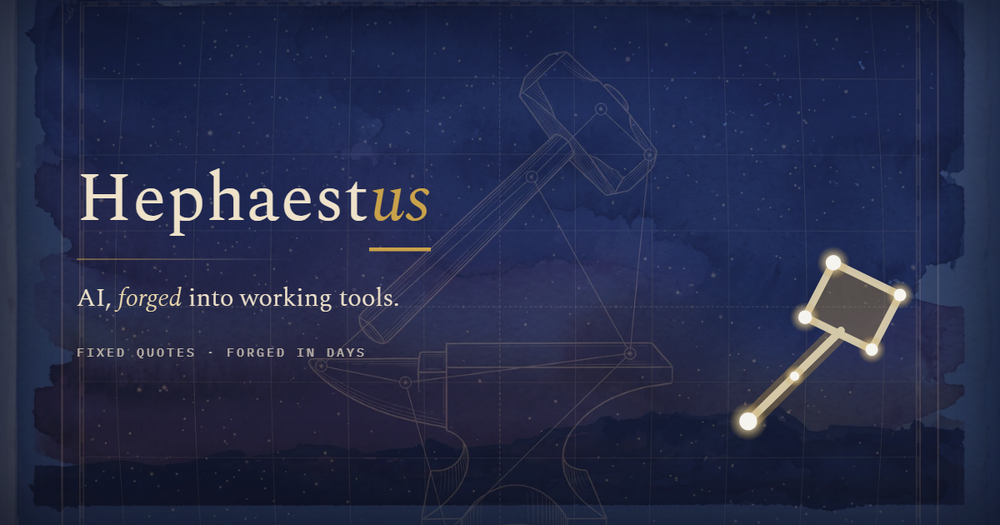
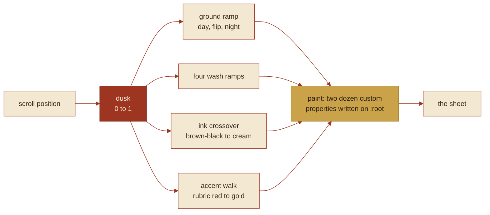
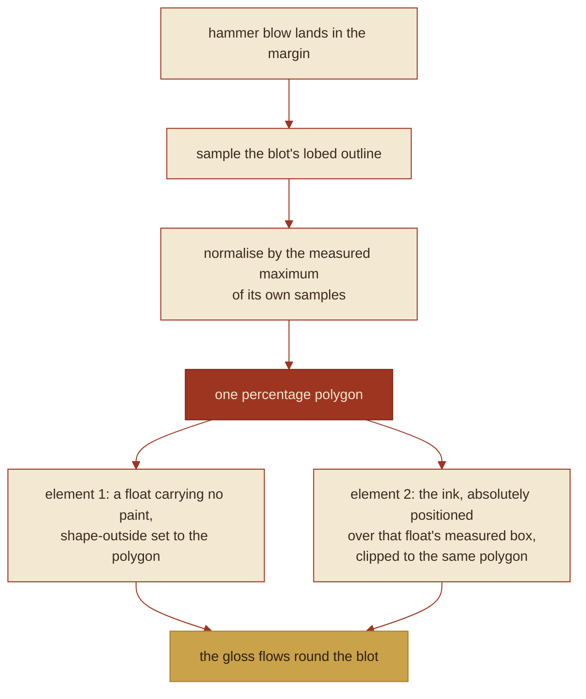
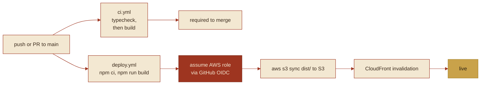

  

  ARCHITECTURE · THE OPEN MARGIN

# How the site is built

[usehephaestus.com](https://usehephaestus.com) is a warm vellum sheet with torn deckle edges. Scrolling
it turns the hour, dawn to night. Seven hammer blows fall down the page, and each one throws wet pigment
into the marginalia column, where the running Homeric gloss flows around the blot's own outline.

It is one HTML file and one TypeScript module. There is no framework.

> This repository is the public showcase — documentation, diagrams, and screenshots. It carries no
> application source code. What follows describes the private site repository.

---

## At a glance

| | |
|---|---|
| **Markup + styles** | One static `index.html`, all CSS inline. About 95 kB on disk, about 25 kB gzipped over the wire. |
| **Behaviour** | One typed module, `src/sheet.ts` — 1,224 lines, building to 25.3 kB of JS, 10.9 kB gzipped. |
| **Build** | Vite 5. `npm run build` is `tsc -b && vite build`. |
| **Runtime dependencies** | Zero. `typescript` and `vite` are the only entries in `devDependencies`. |
| **Not present** | React, animation libraries, analytics, backend, database, browser-side API keys. |
| **Hosting** | AWS S3 behind CloudFront. GitHub Actions on push to `main`, authenticating by OIDC. |
| **Type** | Self-hosted woff2: EB Garamond and Spectral for text, IBM Plex Mono for labels and rubrics. |
| **Built on** | Anthropic's Claude. |

An earlier version of this site was a React single-page app with a canvas particle engine and a motion
library. It was retired. Everything below is what replaced it, and the replacement ships less JavaScript
than the dependency manifest it deleted.

---

## It renders without JavaScript

The CSS defaults are not a neutral fallback state. They are a composed late-dusk moment: ground, washes,
ink and accent all set to one deliberate point on the day's ramp, so the static HTML is a finished page
before the script has parsed. The module's job is to move that page through the rest of the hours, not to
assemble it.

That constraint decided the rest of the architecture. Anything the eye needs on first paint has to be
expressible as a CSS custom property with a sensible literal default.

---

## Scroll is the hour

One number drives the entire colour system: `dusk`, the page's scroll progress, 0 to 1.

Four things move together, all hand-written, no colour library:

- **Ground.** Three ramps (day, flip, night) carry the sheet from vellum `#F6F0E1` through a dusk
  `#DCA97E` to `#2C2547` and then `#080C1C`.
- **Washes.** Four separate ramps, so the watercolour bleeds do not all turn at the same rate as the
  paper underneath them.
- **Ink.** Crosses over from brown-black `#3B2A1C` on light paper to cream `#F3E8D2` on night sky. It is
  a real inversion rather than an opacity fade, because in the middle of the ramp neither colour holds
  contrast against the ground on its own.
- **Accent.** Walks from rubric red `#9E3520` in daylight to gold `#C9A24A` as the page darkens — which
  is also why the brand mark is a constellation. By the time the reader reaches the mark the page is a
  night sky, and the accent has already become the colour of a star.

### Seven blows

`cyc = dusk × 7`. Seven hammer blows down the length of the sheet, positioned by scroll rather than by a
clock, so the reader's own pace decides when the hammer falls.

A second value, `commit`, is scroll velocity, and it sets the *character* of a blow rather than its
timing: how hard the figure swings, how much water lands, how far the pigment runs. Reading slowly and
flicking to the bottom produce the same seven blows, struck differently.

---

## The figure is a real rig

The automaton standing at the right of every viewport is not a sprite sequence and not a pre-rendered
animation. It is an eleven-link inverse-kinematic skeleton solved in 3D, viewed through an orthographic
three-quarter camera, with the origin pinned at the planted rear foot — so the foot is the fixed thing
and the body moves around it, which is the way it works when you actually swing a hammer.

The hammer haft is part of the solve rather than a rigid child bone: it is integrated as a spring, so the
head lags the hands into the blow and rings out of it.

Every outline on the figure is then redrawn with a seeded wobble. There is no straight machine line
anywhere on it. Seeding the wobble makes it stable across frames, so the edge reads as hand-drawn instead
of noisy — it wanders the same way every time you look at it.

---

## Three canvases

| Canvas | Holds | Redrawn |
|---|---|---|
| **sky** | Stars, blitted from pre-baked sprites rather than drawn one at a time | As the night ground comes up |
| **stain** | Dried paint: the permanent record of the sheet | Once per blow, by stamping |
| **bloom** | Live wet marks, still moving | Per frame while a blot is wet |

The watercolour model is the one physical thing the page is trying to reproduce: **a drop of water
landing in a wash that has already begun to dry.** Pigment does not spread evenly out of that. It runs
*out* of the impact and piles into a hard irregular ring at the wet edge, spreads, dries, and is then
stamped once into the permanent sheet — after which the bloom layer forgets it and the stain layer owns
it. That stamp is why the sheet accumulates a history of the reading without the per-frame cost growing
along with it.

---

## The margin mechanic

This is the part that is genuinely new, and it is a typesetting problem rather than a graphics one.

A blow throws pigment into the marginalia column, and the nearest gloss takes it. The words have to flow
around the actual blot, not around a bounding box that approximates it. CSS has exactly one tool for
that, `shape-outside`, and it applies only to floats. A float cannot be the ink, because the ink has to
sit *over* the text column rather than displace it.

So each blot is **two elements sharing one polygon**:

The shape the reader's eye sees and the shape the words obey are the same list of coordinates, so they
agree to the decimal. Two independently tuned approximations of the same blob would drift apart at
exactly the place a reader is looking.

Three details that took the longest:

**Normalise by measurement, not by a constant.** The polygon is scaled by the measured maximum of its own
samples, so it inscribes its box exactly. Normalising against a guessed constant leaves the blot either
floating inside a too-large box, or clipped flat against the box's square edges — and a square-clipped
watercolour blot reads instantly as a bug.

**Paper wets ahead of colour.** The shape is committed the instant the water lands; the pigment then
grows into it over 660 ms. The text reflows first and the blot arrives into the hole it made. In the
other order you get the ugly version, where words jump out of the way of paint that is already sitting
there.

**Lifting a blot is not the reverse of laying one.** Removing it leaves behind the pigment that had
already sunk into the fibre — a ghost in the stain layer, which is correct, because that is what lifting
a half-dried blot actually leaves on paper. But it collapses the float immediately: there is nothing wet
left for the words to avoid, so the text closes back over the ghost.

---

## Two rates, not one

The loop runs at two different rates on purpose.

| | Rate | Why |
|---|---|---|
| **Body** | Every frame the display offers | About 50 attribute writes on one small SVG subtree. It is the only thing on the page the eye is tracking. |
| **Colour + canvases** | Gated at 40 Hz | `paint()` writes two dozen custom properties on `:root`, which invalidates document style. Cheap 40 times a second, not 120. |

A single 40 fps gate for everything was the bug this replaced, and it is worth naming because the symptom
does not present as a frame-rate problem. 40 fps against a 60 or 120 Hz display does not land evenly on
vsync: frames present at 33 ms, 17 ms, 33 ms. Averaged, that is 40 fps. Watched, on a figure that size
swinging a hammer, the alternation reads as a limp. The fix was not more frames. It was giving the thing
the eye follows the display's own cadence, and leaving the expensive document-wide work at a rate nobody
can see.

---

## Guards

- **Hidden tab.** The loop is paused when the document is not visible.
- **`prefers-reduced-motion`.** The loop never starts. One composed static frame is drawn instead — the
  same finished page, at one hour, holding still.
- **No 2D context.** If the browser will not hand one over, the page stands still rather than throwing on
  every frame. A canvas that cannot be drawn is a decoration that is missing, not a page that is broken.
- **Self-check.** One assertion pass runs once, after the first frame:
  - the rig — the planted foot does not slip, every joint stays inside its range, and the hammer lands
    where the hammer is supposed to land;
  - the margin invariant — every generated polygon closes inside its own box, and the shape the words are
    obeying is byte-identical to the shape the ink is clipped to.

  Both are failures that look plausible in a screenshot and wrong in motion, which is exactly the kind
  worth asserting rather than eyeballing.

---

## The phone band

A `small` branch runs throughout the module rather than sitting as a wrapper around it, because the phone
is the device this sheet is hardest on and the savings have to come out of the hot paths, not out of a
media query. The masks are pre-baked instead of repainted against scroll, which buys back the
main-thread time the figure needs.

---

## Build and deploy

Two workflows, both on Node 20:

- **`ci.yml`** typechecks with `npx tsc --noEmit` and then builds. It is required to merge, so a type
  error cannot reach `main`.
- **`deploy.yml`** runs on push to `main` and on manual dispatch. It builds, assumes an AWS role by
  **GitHub OIDC** (there are no long-lived AWS keys in the repository or its secrets), syncs `dist/` to
  S3 with `--delete`, and invalidates CloudFront.

Deploys are serialised on a `deploy-prod` concurrency group with `cancel-in-progress: false`, so an
in-flight S3 sync is allowed to finish and the next deploy queues behind it. A sync cancelled halfway
through is a half-deployed site.

---

## What isn't here

No backend. No database. No API keys in the browser. No analytics, and so no cookie banner, because there
is nothing to consent to. The site is static files on a CDN, and all it asks of a client is one 25 kB HTML
document, one 11 kB script, and the fonts.

   
  © 2026 Hephaestus · Sai Kasani · <a href="https://usehephaestus.com">usehephaestus.com</a>

