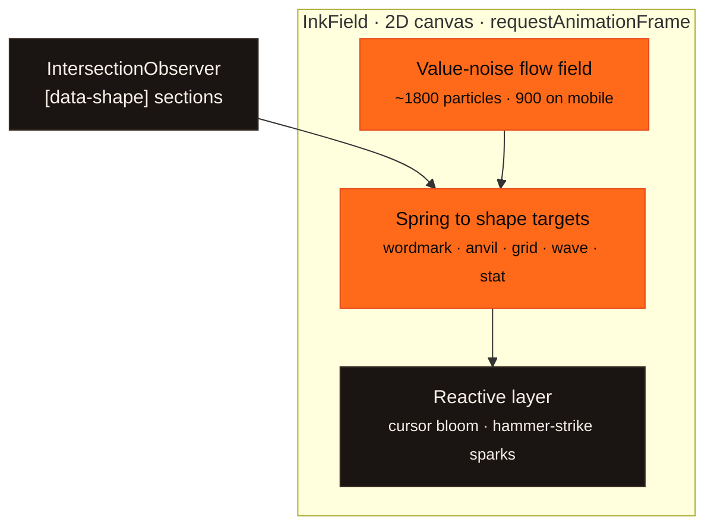
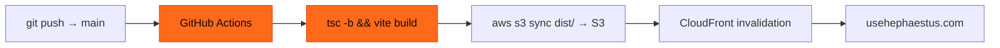

# Architecture

A developer-oriented tour of how the Hephaestus site is built. Conceptual only — **this document
contains no proprietary source code.** For the overview and screenshots, see the [README](README.md).

Hephaestus's public site is deliberately simple where it can be and detailed where it counts: a
**static single-page React app** with **no backend**, whose one piece of real engineering is a
hand-written **canvas particle engine** and a carefully choreographed, accessible motion layer.

The ideas that shape it:

1. **Static and self-contained** — no server, no database, no API keys in the browser. It builds to
   plain files and serves from a CDN.
2. **One signature interaction, done well** — a single canvas engine carries the whole "forge"
   identity instead of a pile of libraries.
3. **Fast and accessible by default** — a performance budget, reduced-motion support, and zero layout
   shift are requirements, not afterthoughts.

---

## 1. Frontend

- **Stack.** React 18 + TypeScript + Vite, built to a static bundle (`tsc -b && vite build`) with
  `strict` and `noUnusedLocals`.
- **Single page.** The entry (`main.tsx`) mounts one marketing page composed of sections — hero,
  pillars, services, process, work, about, contact. No router, no authenticated area, no data layer.
- **Design system.** A hand-rolled CSS-variable system: a warm **iron-black + molten-ember** forge
  palette, JetBrains Mono for headings, Inter for body. Tokens live in one stylesheet.

---

## 2. The forge — InkField

The background is a fixed, full-page HTML5 Canvas engine (~800 lines, no animation dependencies).

- **Flow.** Each particle reads a single-octave 3D value-noise field for its heading and is drawn as a
  short additive streak. Density is bucketed into a forge heat ramp, so sparse regions read as cooling
  red and dense regions as white-hot.
- **Morph.** Each scroll section carries a `data-shape`; an `IntersectionObserver` selects the active
  one and particles spring toward points sampled from that shape — text like "Hephaestus", the anvil
  silhouette, a grid, a wave, a stat.
- **React.** On a fine pointer, a pre-rendered white-hot bloom follows the cursor and gently gathers
  nearby embers. A click is a **hammer strike**: an expanding shockwave ring perturbs the field and a
  burst of sparks flies out, arcs under gravity, and cools as it fades.

### Performance & accessibility guards

- Baked **exposure cap** on additive alpha so peaks can't accumulate to a blinding white.
- **Device pixel ratio clamped** (≤1.5) and particle count halved on mobile.
- **`prefers-reduced-motion`**: no animation loop at all — a single static formed frame is drawn, and
  the click/hover effects are disabled.
- The loop pauses on `visibilitychange`; every listener, rAF, resize timer, and observer is disposed
  on unmount (safe under React StrictMode's development double-mount).

---

## 3. Motion layer

- **Scroll reveals.** Section blocks fade and slide in with **Framer Motion** `whileInView` (once).
- **Forge titles.** A small `ForgeTitle` component animates headings from white-hot to their rest
  color as they enter view; under reduced motion it renders a plain heading with no animation.
- **Zero layout shift text.** Paragraph line breaks are measured off-DOM (a pretext pass) so each line
  animates in with its height reserved up front — no reflow, no jump.

---

## 4. Deployment

- **Build:** static bundle to `dist/`.
- **Host:** **AWS S3 + CloudFront**. GitHub Actions builds and deploys on every push to `main`,
  authenticating to AWS via **GitHub OIDC** — a short-lived role assumption, with no long-lived AWS
  keys stored in the repo — then syncs `dist/` to S3 and invalidates the CDN.

---

## Design principles, one line each

- **Static beats a server you don't need** — no backend, no keys, nothing to run.
- **One signature, engineered well** — a single canvas engine over a pile of animation libraries.
- **Reduced motion is a first-class path** — not a stripped afterthought.
- **Zero layout shift** — measure text, reserve space, then animate.
- **Deploy on merge** — push to main, CI ships it.
