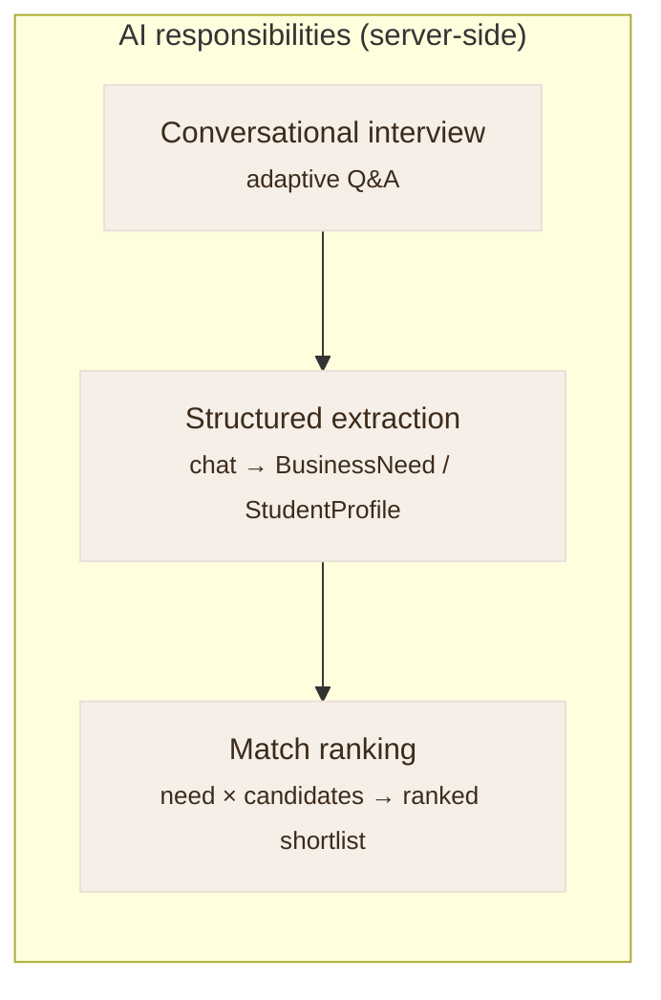
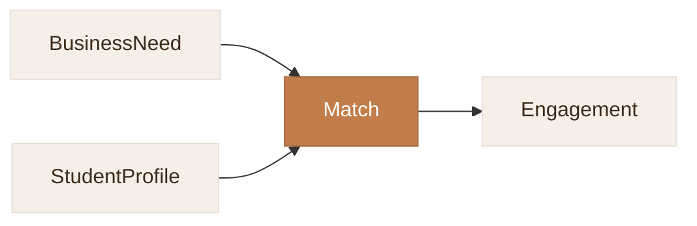
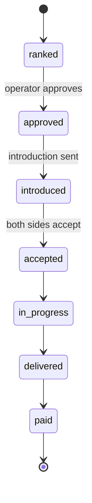
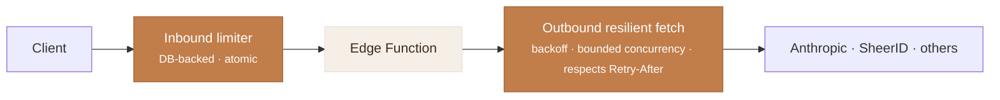

# Architecture

A developer-oriented tour of how TriangleAI is built. This document describes the system at a
conceptual level — **it contains no application source code.** For the high-level overview and
screenshots, see the [README](README.md).

The three ideas that shape everything:

1. **Swap seams** — every external dependency sits behind an interface with a dev implementation and a
   production implementation, so the whole product runs locally with zero configuration.
2. **Server-side AI** — Claude is only ever called from the server; the browser never holds a key.
3. **Graceful degradation** — every AI path has a deterministic fallback, so the product bends instead
   of breaking.

---

## 1. Frontend

A single-page app built with **React 18 + TypeScript + Vite**.

- **Two surfaces, one build.** A public marketing site at `/` and an authenticated application under
  `/app/*` (operator console, interview/intake, match status, profile), plus a separate scroll-driven
  interactive demo built as its own Vite entry.
- **Design system.** The marketing site uses a **hand-rolled CSS-variable design system** — a warm
  cream / terracotta palette with Lora (serif headings) and DM Sans (body). Design tokens (color, type
  scale, radii, warm-tinted shadows, spacing) live in one stylesheet. **Tailwind is deliberately scoped
  to the interactive demo only**, so it never leaks into the main site's tokens.
- **Strict TypeScript.** The build runs `tsc -b && vite build` with `strict` and `noUnusedLocals`.

---

## 2. The swap-seam pattern

The same pattern recurs for every external dependency: define an interface, provide a **dev**
implementation (no network, deterministic, seeded) and a **production** implementation, and select
between them at the edge.

| Concern | Interface | Dev implementation | Production implementation |
|---|---|---|---|
| Data & auth | `Backend` | localStorage mock (seeded) | Supabase (Postgres · Auth · RLS · Edge Functions) |
| AI interview | Interview provider | Deterministic scripted interview | Claude (text) · live voice (opt-in) |
| Identity | Identity / SSO | Demo sign-in (any `.edu`) | University SSO via Google / Microsoft |
| Enrollment | Enrollment verifier | Auto-approve | SheerID + server webhook |
| LLM transport | LLM client | Vite dev API route | Supabase Edge Function |

Because the selection happens behind the interface, **app code is identical in both modes.** A
contributor can clone the repo and run the entire experience — interview, ranking, operator queue —
with `npm run dev` and **no environment variables at all**. Adding keys lights up the real services
incrementally (e.g. an Anthropic key alone upgrades the local interview from scripted to live Claude
while everything else stays mocked).

---

## 3. The AI layer

### Keys never reach the browser

All Claude calls are proxied through the server:

- **Locally**, a small Vite dev API exposes routes for the interview turn, structured extraction, and
  match ranking.
- **In production**, the same responsibilities are Supabase **Edge Functions**, sharing a common LLM
  helper module.

The client talks to a single transport abstraction and never holds an API key.

### Three AI responsibilities

1. **Interview** — an adaptive conversation that asks only what it still needs.
2. **Extraction** — turns the free-form conversation into a typed, structured record.
3. **Ranking** — scores candidates against a need and returns a shortlist with rationale.

### Fallbacks

Each responsibility has a deterministic counterpart. If Claude is unavailable, errors, or is
rate-limited — at the **start of a session or mid-session** — the UI transparently falls back:

| Responsibility | Primary | Fallback |
|---|---|---|
| Interview | Claude conversational intake | Deterministic scripted interview |
| Extraction | Claude structured extraction | Heuristic field mapping |
| Ranking | Claude ranker | Local weighted scorer |
| Voice | Live voice provider | Text chat (voice is opt-in, off by default) |

---

## 4. The matching engine

For each business need, the engine scores every eligible candidate across six weighted dimensions:

| Dimension | Weight |
|---|:--:|
| Skill overlap | 0.30 |
| Budget ↔ rate fit | 0.18 |
| Availability ↔ timeline | 0.14 |
| Complexity ↔ student level | 0.14 |
| Interest / industry alignment | 0.12 |
| Location / remote fit | 0.12 |

Key properties:

- **One source of truth for the weights.** The Claude ranker and the local fallback scorer read the
  **same** weight configuration, so rankings are consistent and explainable no matter which path ran.
- **Explainable output.** Each candidate carries a fit score and a plain-English rationale that the
  operator sees in the queue.
- **Pool floor before geography widening.** A minimum candidate pool is guaranteed before the location
  filter is relaxed, so a thin local pool never yields an empty shortlist.

---

## 5. Data model & lifecycle

The interview produces structured records; matches and engagements move through explicit states.

The engagement lifecycle is a small state machine, gated by human approval and mutual acceptance:

A computed **service fee** (default 18%) is attached to each engagement. During the pilot, invoicing is
manual / off-platform; Phase 2 introduces Stripe Connect behind a feature flag for in-app payouts and
automated fees.

---

## 6. Security model

### Authentication & identity

- **Students** sign in with **university SSO** (Google / Microsoft) — proving a `.edu` identity rather
  than asserting one. **Enrollment** is then independently confirmed via **SheerID** before a student is
  matchable. The enrollment result is written **only by a service-role function** and is **bound to the
  caller's verified account by email**; the webhook path requires a shared secret. A student cannot
  self-certify enrollment.
- **Businesses** sign up with a work email (passwordless email OTP), with an optional password.
- **Operators** have a dedicated `admin` role that gates the match queue, approvals, and engagement
  views.

### Row-Level Security

Authorization lives in the database. Postgres **RLS policies** govern every table's reads and writes.
Cross-table checks (e.g. "does this user own the business need behind this match?") are factored into
`SECURITY DEFINER` helper functions, which keeps policies:

- **Non-recursive** — a policy on `matches` that needs to consult `business_needs` calls a helper rather
  than referencing the other table's policies inline (which previously caused infinite policy
  recursion — now resolved).
- **Auditable** — the authorization logic is named and centralized.

Sensitive columns (verification flags, enrollment status) are **not writable by clients at all** — only
the relevant service-role function can set them.

### Rate limiting

- **Inbound:** a database-backed **atomic** limiter protects every Edge Function. Sensitive endpoints
  carry both a global cap and a stricter per-identity cap to resist spoofing.
- **Outbound:** calls to third-party APIs go through a resilient fetch wrapper with retry + exponential
  backoff, bounded concurrency, and respect for `Retry-After`. Non-idempotent sends retry only on
  explicit rate-limit responses.

---

## 7. Local development & zero-config demo

The seeded mock backend makes the product fully explorable offline:

- A seeded **operator** account, a pool of `.edu`-verified students who have completed interviews, and a
  business with an open need — so the **match queue is populated on first run**.
- The interview runs as a deterministic script; ranking uses the local scorer; identity uses a demo
  sign-in. Nothing leaves the machine.
- State lives in `localStorage` under a namespaced prefix and resets cleanly.

This is the mode the screenshots in the README were captured from.

---

## 8. Deployment

- **Build:** `npm run build` → a static bundle (the marketing site, the app, and the interactive demo as
  separate entries).
- **Host:** **AWS S3 + CloudFront**. A CI pipeline builds, uploads, and invalidates the CDN on every push
  to `main`. SPA routing is handled at the edge so deep links resolve.

---

## Design principles, in one line each

- **Interfaces over integrations** — depend on a seam, not a vendor.
- **The server holds the secrets** — never the browser.
- **Always have a Plan B** — every AI call degrades to deterministic behavior.
- **Authorization in the database** — RLS + `SECURITY DEFINER`, not just app checks.
- **A human approves** — AI ranks and drafts; a person decides.
