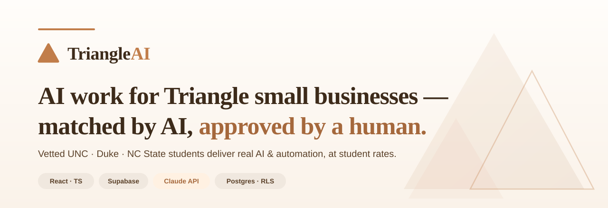
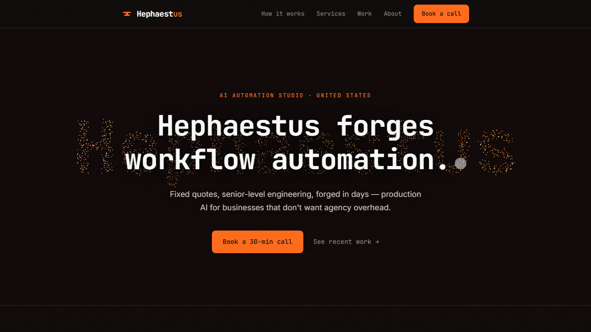
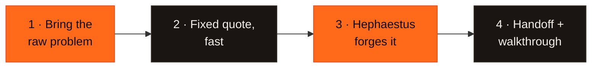

  

<h1 align="center">Hephaestus</h1>

  <strong>An automated AI automation studio. Data cleanup, workflow automation, chatbots,
  document processing, and internal tools — scoped fast, forged in days, at a fraction of agency cost.</strong> 
  <em>AI, forged into working tools.</em>

  
  
  
  
  
  
   
  
  
  

  <a href="#what-it-is">What it is</a> ·
  <a href="#see-it">See it</a> ·
  <a href="#how-it-works">How it works</a> ·
  <a href="#what-we-forge">What we forge</a> ·
  <a href="#under-the-hood">Under the hood</a> ·
  <a href="#tech-stack">Tech stack</a> ·
  <a href="#about">About</a>

> **About this repository.** A **public showcase** of Hephaestus for fellow developers — what it is
> and how the site is engineered. It contains **no proprietary source code**; everything here is
> documentation, diagrams, and screenshots.

---

## What it is

Every small and mid-size business keeps hearing *"AI could do that for you."* The unanswered question
is always the same: **okay, but who actually builds it?** Agencies are expensive and slow. Freelancer
marketplaces are noisy and unvetted. Nobody on the team has time to wire the tools together.

**Hephaestus closes that gap.** It's an automated AI automation studio for businesses across the
United States: you bring the raw problem, Hephaestus scopes it into a **fixed quote fast**, forges the
solution **in days**, and hands it over — documented, tested, and yours to keep. No agency overhead,
no lock-in, senior-level engineering on every job.

---

## See it

  

The site itself is the demo: a single-page **interactive forge**. A full-page canvas ember field flows
and morphs into the wordmark and an anvil, cursor motion stirs the embers, and clicking anywhere throws
a **hammer-strike shower of sparks**. Fast by design, and it respects `prefers-reduced-motion`.

---

## How it works

Four steps. Days, not weeks.

1. **Bring the raw problem.** A quick call or message. Honest about fit — if it's not right, we say so.
2. **Fixed quote, fast.** Clear scope, a fixed price, and a delivery date — usually within a day.
3. **Hephaestus forges it.** Visible progress and a working result in days. No black boxes.
4. **Handoff + walkthrough.** Everything handed over with a short walkthrough. Yours, no lock-in.

---

## What we forge

| Service | What it covers |
|---|---|
| **Data cleanup** | Messy spreadsheets → clean, deduped, normalized, enriched. |
| **Workflow automation** | Stitch tools together; replace manual copy-paste with one-click pipelines. |
| **Chatbots & assistants** | Internal Q&A and customer-facing bots, scoped to your docs. |
| **Document processing** | Structured data pulled from contracts, invoices, intake forms, PDFs. |
| **Internal tools** | A working v1 of the dashboard or admin tool you keep meaning to build. |

A starting menu, not a fence — anything that can be sped up with AI likely fits, and gets scoped up front.

---

## Under the hood

> The part for fellow developers. Full write-up in **[ARCHITECTURE.md](ARCHITECTURE.md)**.

The Hephaestus site is a **single-page React + Vite app**, statically built and served from **AWS S3 +
CloudFront**, deployed by GitHub Actions on every push to `main`. No backend, no database, no API keys
in the browser — the signature is a hand-written **HTML5 Canvas particle engine**.

### The forge (InkField)

The ambient background is one ~800-line canvas engine, with no animation dependencies:

- **Value-noise flow field.** ~1,800 particles (900 on mobile) advected through a single-octave 3D
  value-noise field, drawn as additive streaks in a forge heat ramp (forge-red → molten orange → spark
  amber → white-hot).
- **Morph targets.** Particles spring toward points sampled from a shape per scroll section — the
  "Hephaestus" wordmark, an anvil, a grid, a wave — chosen by an `IntersectionObserver` over
  `[data-shape]` sections.
- **Reactive.** A white-hot bloom follows the cursor and gathers embers; a **hammer-strike** on click
  emits an expanding shockwave ring plus a gravity-arced spark burst.
- **Bounded + accessible.** A baked exposure cap stops density from blowing out to white; device pixel
  ratio is clamped; `prefers-reduced-motion` draws a single static frame with no loop; every listener,
  rAF, and observer is torn down on unmount (safe under React StrictMode).

### Motion

Section content reveals with **Framer Motion** (`whileInView`), headings **cool from white-hot** as
they scroll in (a small `ForgeTitle` component, with a plain-text fallback under reduced motion), and
paragraph line breaks are pre-measured off the DOM so text reveals with **zero layout shift**.

---

## Tech stack

| Layer | Choice | Notes |
|---|---|---|
| **Frontend** | React 18 · TypeScript · Vite | Single-page marketing site; static build. |
| **Design system** | Hand-rolled CSS variables | Warm iron-black + molten-ember forge palette; JetBrains Mono + Inter. |
| **Motion** | Framer Motion + HTML5 Canvas | Scroll reveals + the InkField particle/spark engine. |
| **Analytics** | PostHog | Loaded lazily after paint, off the critical render path. |
| **Hosting** | AWS **S3 + CloudFront** | GitHub Actions deploys on push to `main` via OIDC — no long-lived keys. |
| **Type safety** | TypeScript `strict` (`noUnusedLocals`) | Build is `tsc -b && vite build`. |

> Built on Anthropic's **Claude** — AI-native, not AI-bolted-on.

---

## About

**Hephaestus** is an automated AI automation studio serving businesses across the United States —
senior-level engineering, fixed quotes, delivery in days, no agency overhead.

- **Web:** [usehephaestus.com](https://usehephaestus.com)
- **Built by:** Sai Kasani — CS + Finance, UNC · Claude Builder Ambassador
- **Contact:** [sai.kasani@lafayettestandard.com](mailto:sai.kasani@lafayettestandard.com)

   
  © 2026 Hephaestus. This repository is a public showcase and contains no proprietary source code.

