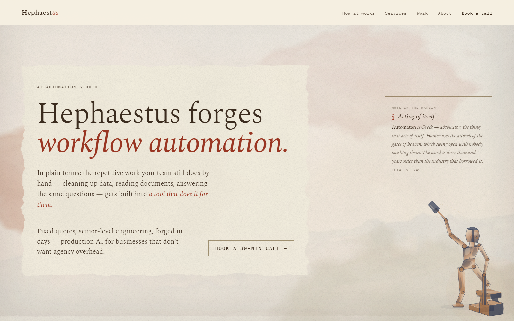
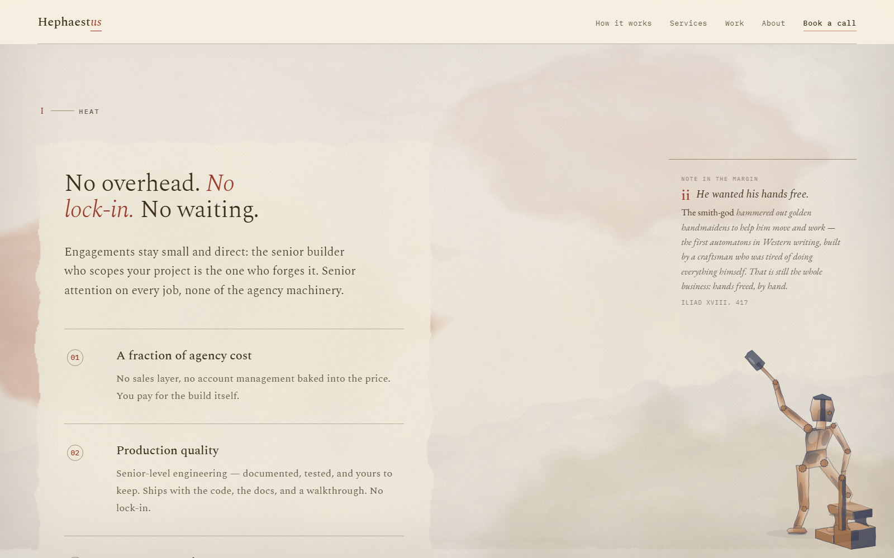
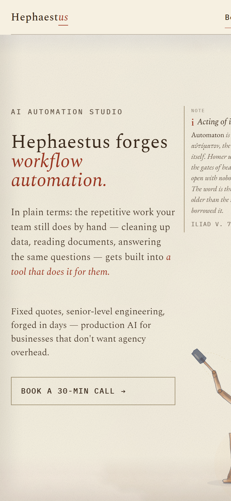

  

  AI AUTOMATION STUDIO · UNITED STATES · REMOTE

  <strong>A student-led studio that puts an engineer inside your team: forward-deployed, not handed to an account manager. 
  We build the work your people still do by hand into a tool that does it for them.</strong>

  <em>Fixed quotes. Senior-level engineering. Forged in days.</em>

  
  
  

  

> **i · Acting of itself.**
> *Automaton* is Greek — αὐτόματον, the thing that acts of itself. Homer uses the adverb of the gates
> of heaven, which swing open with nobody touching them. The word is three thousand years older than
> the industry that borrowed it.
>
> ILIAD V. 749

---

I · HEAT

## No overhead. *No lock-in.* No waiting.

Engagements stay small and direct: the senior builder who scopes your project is the one who forges it.

**01 · A fraction of agency cost.** No sales layer, no account management baked into the price. You pay for the build itself.

**02 · Production quality.** Documented, tested, and yours to keep. Ships with the code, the docs, and a walkthrough.

**03 · Days, not weeks.** Same-day first reply, a fixed quote within a day, most projects delivered inside a week.

II · DRAW

## What we forge

| Service | What it is |
|---|---|
| **Data cleanup** | Hand over the messy spreadsheet; get back clean, deduped, consistently formatted data. |
| **Workflow automation** | The repetitive copy-paste task that eats a week becomes a one-click job that runs itself. |
| **Chatbots & assistants** | A helper that answers questions from your own docs — for your team or your customers. |
| **Document processing** | Contracts, invoices, intake forms, PDFs: the numbers and details you need, pulled out and organized. |
| **Internal tool prototyping** | The dashboard or admin tool you keep meaning to build, delivered as a working v1 in days. |
| **Something else?** | If it can be made faster or smarter with AI, it probably fits. |

A starting menu, not a limit.

III · BLOW

## The sheet

  
  

  The pillars and the second note in the margin · the phone band.

The site is one HTML file and one TypeScript module, no framework. Scroll turns the hour, dawn to
night, and each of seven hammer blows throws wet pigment into the marginalia column, where the words
flow around the blot's own outline. The ink lands in the margin; the hand writes round it.

**[How it is built → ARCHITECTURE.md](ARCHITECTURE.md)**

IV · STRIKE

## Four steps, start to handoff

1. **Bring us the raw problem.** A quick call to walk through what you need. We are honest about fit.
2. **Fixed quote, fast.** A clear scope, a fixed price, a delivery date usually within a day, and no hourly meter.
3. **We forge it.** Visible progress and a working result in days, no black boxes.
4. **Handoff + walkthrough.** Handed over with a short walkthrough so your team can run it. It's yours.

V · WELD

## The shape of an engagement

The three below are illustrative — the shape of the work we take on, not named client engagements.

| | Problem | Result |
|---|---|---|
| **Law-firm intake extraction** | Paralegals hand-keying details from hundreds of intake PDFs. | Clean, structured records in minutes — reviewed, not retyped. |
| **Ops dashboard** | Weekly numbers scattered across five spreadsheets and a CRM. | One live dashboard the whole team checks each morning. |
| **Support chatbot** | The same twenty questions filling up the support inbox all day. | Instant answers on-site; the inbox is for real issues now. |

THIS REPOSITORY

## Under the hood

No source code here: this repo is documentation, diagrams, and screenshots. The engineering write-up
lives in **[ARCHITECTURE.md](ARCHITECTURE.md)**: the scroll-driven colour system, the inverse-kinematic
figure, the three-canvas watercolour model, and the margin trick where a paint-less float and the ink
over it are clipped to one shared polygon so the text wrap and the blot agree to the decimal.

- **Front end.** One static `index.html` plus one typed module, `src/sheet.ts`: 25 kB of JS, 11 kB gzipped.
- **Dependencies.** Zero at runtime. `typescript` and `vite` are the only devDependencies.
- **Renders without JavaScript.** The CSS defaults are a composed late-dusk moment; the script is enhancement.
- **Hosting.** AWS S3 and CloudFront, deployed by GitHub Actions on push to `main` via OIDC.

VI · QUENCH

## Small studio. National reach.

An independent AI automation studio working with businesses across the United States: data cleanup,
document processing, assistants, and the internal tools teams keep wishing they had. Book a 30-minute
call and you'll leave it with next steps and a fixed quote the same day.

- **Web** · [usehephaestus.com](https://usehephaestus.com)
- **Contact** · [kasani@business.unc.edu](mailto:kasani@business.unc.edu)
- **Built by** · Sai Kasani · CS + Finance, UNC · Claude Builder Ambassador

> **viii · Honest about fit.**
> A blot that has begun to dry cannot be lifted clean — the pigment has already sunk into the fibre and
> what comes off is only the surface. So the answer arrives on the call, not in a proposal three weeks
> later: if it isn't a good job for us we will say so while it is still wet.

   
  © 2026 Hephaestus · Sai Kasani

